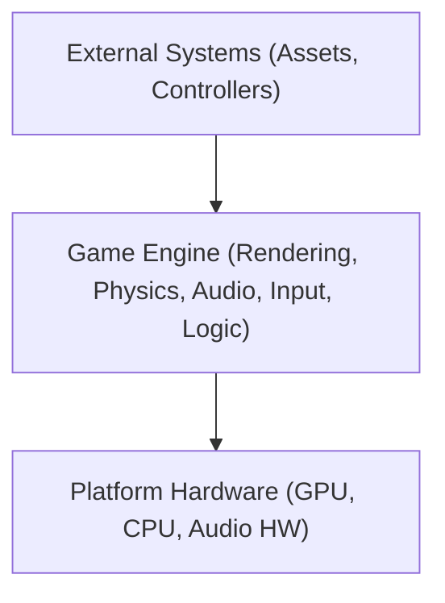
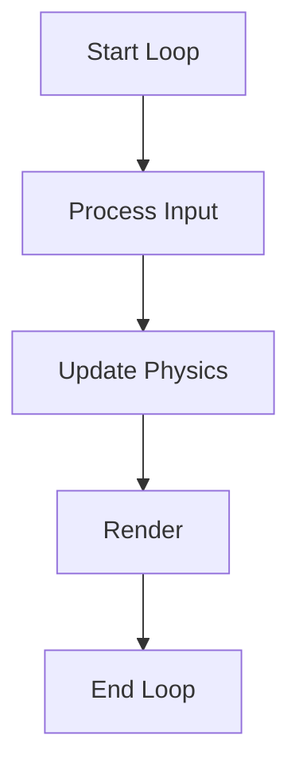

# Technical Design Document (TDD) for C++ Game Engine

## Document Header
- **Project Title:** Dark Matter Engine
- **Version:** 1.0
- **Date:** 2025-03-07
- **Author(s):** Ari / Raytroll / Cyparisss / Tavares Silva Ivania / ZoraNovachrono / Gabriel / ND972 
- **Contact:** [AriLeGrand](https://github.com/AriLeGrand) / [Raytroll](https://github.com/Raytroll) / [Cyparisss](https://github.com/Cyparisss) / [IvaniaTAVARESSILVA](https://github.com/IvaniaTAVARESSILVA) / [ZoraNovachrono](https://github.com/ZoraNovachrono) / [FTGabriel](https://github.com/FTGabriel) / [ND972](https://github.com/ND972)

## Revision History
| Date       | Version | Description                | Author        |
|------------|---------|----------------------------|---------------|
| 2025-03-07 |   1.0   | Initial document creation  | All           |

## Table of Contents
1. [Introduction](#1-introduction)
2. [System Overview](#2-system-overview)
3. [Requirements](#3-requirements)
4. [System Architecture & Design](#4-system-architecture--design)
5. [Detailed Module Design](#5-detailed-module-design)
6. [Interface Design](#6-interface-design)
7. [Performance and Optimization](#7-performance-and-optimization)
8. [Testing Strategy (TDD Implementation)](#8-testing-strategy-tdd-implementation)
9. [Tools, Environment, and Deployment](#9-tools-environment-and-deployment)
10. [Security and Safety Considerations](#10-security-and-safety-considerations)
11. [Project Timeline and Milestones](#11-project-timeline-and-milestones)
12. [Appendices](#12-appendices)

---

## 1. Introduction

### 1.1 Purpose
This document outlines the technical design for a modular C++ Game Engine, detailing its architecture, modules, and Test-Driven Development (TDD) approach.

### 1.2 Scope
- **Objective:** Develop a cross-platform game engine for rendering, physics, audio, and input management.
- **Application:** Real-time game development and academic projects.

### 1.3 Definitions, Acronyms, and Abbreviations
- **TDD:** Test-Driven Development  
- **API:** Application Programming Interface  
- **FPS:** Frames Per Second  
- **IDE:** Integrated Development Environment

### 1.4 References
- [C++ Standard Documentation](https://isocpp.org)
- [Google Test Framework](https://github.com/google/googletest)

### 1.5 Document Overview
This TDD details the design, module interactions, and testing strategies for the game engine, ensuring clarity from high-level architecture to low-level implementation details.

---

## 2. System Overview

### 2.1 High-Level Description
The engine is a modular system written in C++ (C++17 or later), designed to manage rendering, physics simulation, audio processing, and input handling in real-time.

### 2.2 System Context Diagram



### 2.3 Major Components
- **Rendering API:** Handles graphics using OpenGL and DirectX11.
- **Physics Manager:** Manages collision detection and physics simulations with Bullet.
- **Audio API:** Processes sound effects and music with MiniAudio.
- **Input Manager:** Captures keyboard and mouse events with default Windows API.

---

## 3. Requirements

### 3.1 Functional Requirements
- Render 3D graphics with shading.
- Perform real-time physics simulation and collision detection.
- Play background music.
- Capture and process user inputs.

### 3.2 Non-Functional Requirements
- **Performance:** Maintain a minimum of 60 FPS.
- **Scalability:** Modular design for easy extension.
- **Maintainability:** Clear code structure with thorough documentation.

### 3.3 Use Cases
- **Rendering:** Load and display scenes.
- **Physics:** Update object states and detect collisions.
- **Audio:** Manage and play audio assets.

### 3.4 Design Constraints and Assumptions
- Use modern C++ (C++17 or later).
- Rely on hardware-accelerated graphics.
- Assume a minimum hardware configuration for target platforms.

---

## 4. System Architecture & Design

### 4.1 Architectural Overview
The engine employs a component-based architecture. Each module has well-defined interfaces, ensuring loose coupling and isolated development.

### 4.2 Module Breakdown
- **Rendering Module:** Handles shaders, textures, and communicates with the GPU.
- **Physics Module:** Implements collision detection and rigid body dynamics.
- **Audio Module:** Interfaces with audio libraries (e.g., OpenAL).
- **Input Module:** Abstracts device-specific input.

### 4.3 Interaction Diagrams

#### Sequence Diagram: Rendering a Frame
```

User Input -> Game Logic -> Rendering Module -> GPU

```

#### Game Loop Flowchart


### 4.4 Design Decisions and Rationale
- **Language Choice:** C++ for high performance.
- **Modular Design:** Supports isolated testing and independent module development.
- **TDD:** Ensures high code quality and early bug detection.

---

## 5. Detailed Module Design

### 5.1 Class Diagrams and Data Structures
- **Rendering:** `Renderer`, `Shader`, `Model`
- **Physics:** `PhysicsEngine`, `Collider`, `RigidBody`
- **Audio:** `AudioManager`, `Sound`
- **Input:** `InputManager`
- **Console:** `LogManager`, `ConsoleManager`

### 5.2 Key Algorithms and Code Snippets

#### Basic Rendering Loop in C++
```cpp
#include <string>
#include <cstring>
#include <windows.h>
#include <iostream>
#include <chrono>
#include <cmath>
#include <thread>
#include <atomic>
#include "RenderBackend.h"
#include "include/PhysicsManager.h"
#include "include/ConsoleManager.h"
#include "include/InputManager.h"
#include "miniaudio/AudioManager.h"
#include "miniaudio/miniaudio.h"
#include "include/InputManager.h"

int main(int argc, char* argv[]) {
    if (argc > 2) {
        Console::GetInstance().Log("Too many arguments", API::MAIN, LEVEL::ERRORS);
        return 1;
    }
    AudioManager audioManager;
    std::string soundFile = "Sounds/NIKKE.mp3";
    Sound sound(&audioManager.engine, soundFile);
    initInputDevice();
    const enum RendererBackend Backend = ParseBackend(argv[1]);
    Renderer::Init(Backend);
    Renderer::Get()->Init();
    Renderer::Get()->createWindow(1920, 1080, "Dark Matter Engine");
    Renderer::Get()->LoadShader("shaders\\basic");
    Renderer::Get()->SetFinnalPassShader("shaders\\FRAME");
    Renderer::Get()->AddScene();
    Renderer::Get()->GetCurrentScene().AddModel("assets\\car\\car.obj", "assets\\car\\tex.jpg");
    Renderer::Get()->GetCurrentScene().AddPostProccessPass("shaders\\SMAA", 1280, 720);
    InputManager& inputManager = InputManager::GetInstance();
    inputManager.Init();
    Renderer::Get()->GetCurrentScene().CreatePhysics();
    ModelInfo* modelInfo = Renderer::Get()->GetCurrentScene().GetModelInfoAtIdx(0);
    Renderer::Get()->GetCurrentScene().AddPhysicsGround();
    Renderer::Get()->GetCurrentScene().AddPhysicsBody(modelInfo);
    while (Renderer::Get()->isWindowOpened()) {
        std::chrono::high_resolution_clock::time_point currentTime = std::chrono::high_resolution_clock::now();
        std::chrono::duration<float> delta = std::chrono::duration_cast<std::chrono::duration<float>>(currentTime - lastTime);
        Renderer::Get()->GetCurrentScene().GetPhysics().getRigidBodies().at(0)->GetBulletBody()->setAngularFactor(btVector3(1, 1, 0));
        Renderer::Get()->GetCurrentScene().GetPhysics().getRigidBodies().at(0)->GetBulletBody()->setLinearFactor(btVector3(0, 1, 0));
        btRigidBody* body = Renderer::Get()->GetCurrentScene().GetPhysics().getRigidBodies().at(0)->GetBulletBody();
        btRigidBody* ground = Renderer::Get()->GetCurrentScene().GetPhysics().getGroundBody();
        bool collision = Renderer::Get()->GetCurrentScene().GetCollisionCheck(*body, *ground);
        if (collision)
        {
            Renderer::Get()->GetCurrentScene().GetPhysics().getRigidBodies().at(0)->DoImpulse(btVector3(0, 0.2, 0));
        }
        Renderer::Get()->GetCurrentScene().GetPhysics().getRigidBodies().at(0)->SetAngularVelocity(btVector3(0, 10, 0));
        Renderer::Get()->GetCurrentScene().UpdatePhysics(deltaTime);
        btTransform transform;
        Renderer::Get()->GetCurrentScene().GetPhysics().getRigidBodies().at(0)->GetBulletBody()->getMotionState()->getWorldTransform(transform);
        btVector3 position = transform.getOrigin();
        btVector3 euler;
        transform.getBasis().getEulerZYX(euler[0], euler[1], euler[2]);
        euler *= (180.0 / 3.14159265358979323846);
        for (int idx = 0; idx < Renderer::Get()->GetCurrentScene().GetModelCount(); idx++) {
            Renderer::Get()->GetCurrentScene().GetModelInfoAtIdx(idx)->position[0] = position.getX();
            Renderer::Get()->GetCurrentScene().GetModelInfoAtIdx(idx)->position[1] = position.getY();
            Renderer::Get()->GetCurrentScene().GetModelInfoAtIdx(idx)->position[2] = position.getZ();
            Renderer::Get()->GetCurrentScene().GetModelInfoAtIdx(idx)->rotation[0] = euler.getX();
            Renderer::Get()->GetCurrentScene().GetModelInfoAtIdx(idx)->rotation[1] = euler.getY();
            Renderer::Get()->GetCurrentScene().GetModelInfoAtIdx(idx)->rotation[2] = euler.getZ();
            for (int idx = 0; idx < Renderer::Get()->GetCurrentScene().GetModelCount(); idx++) {
                Renderer::Get()->GetCurrentScene().GetModelInfoAtIdx(idx)->rotation[1] = i * 55.0f;
            }
            Renderer::Get()->Clear(0.0f, 0.0f, 0.0f, 0.0f);
            Renderer::Get()->GetCurrentScene().Draw();
            Renderer::Get()->DrawUI();
            Renderer::Get()->Present();
            i += 0.001f;
        }
        Renderer::Get()->GetCurrentScene().DestroyPhysics();
        Renderer::Get()->Clear(0.0f, 0.0f, 0.0f, 0.0f);
        Renderer::Get()->GetCurrentScene().Draw();
        Renderer::Get()->DrawUI();
        Renderer::Get()->Present();
        Renderer::Get()->ClearUI();
        Renderer::Shutdown();
    }
}
````

### 5.3 Error Handling and Logging

- Utilize exception handling for critical errors.
- Implement a logging system to record runtime events and performance metrics.

---

## 6. Interface Design

### 6.1 Internal Interfaces

- Define clear APIs between modules using abstract classes or interfaces.

### 6.2 External APIs and File Formats

- Support standard file formats: OBJ (models), PNG (textures), MP3 (audio).
- Provide documentation for external scripting interfaces.

### 6.3 User Interface (if applicable)

- Develop a debug UI for real-time performance monitoring and diagnostics.

---

## 7. Performance and Optimization

### 7.1 Performance Goals

- Consistently achieve 60 FPS.
- Optimize memory usage and processing overhead.

---

## 8. Testing Strategy (TDD Implementation)

### 8.1 Overview of TDD

- Write tests before implementation to drive design decisions and ensure code reliability.

### 8.2 Integration Testing

- Verify that modules interact correctly through integration tests.

### 8.3 Regression Testing

- Maintain a suite of automated tests to catch and fix regressions early.

---

## 9. Tools, Environment, and Deployment

### 9.1 Development Tools and IDEs

- Recommended IDEs: Visual Studio, CLion, or VSCode.
- Code editors that support C++17 features.

### 9.2 Build System and Automation

- Use CMake for project configuration.
- Automate builds using CI/CD pipelines.

### 9.3 Version Control

- Use Git for version control.
- Adopt a clear branching strategy for feature development.

### 9.4 Deployment Environment

- Target platforms: Windows.
- Provide deployment instructions and environment setup guides.

---

## 10. Security and Safety Considerations

- Validate all external input to avoid runtime vulnerabilities.
- Implement robust error handling.
- Perform regular code reviews and security audits.

---

## 11. Project Timeline and Milestones

- **Phase 1:** Requirement Analysis & Detailed Design
- **Phase 2:** Core Module Development (Rendering, Physics, Audio, Input)
- **Phase 3:** Integration and Testing
- **Phase 4:** Optimization and Final Deployment
- Outline milestones with deadlines and deliverables.

---

## 12. Appendices

### 12.1 Glossary

- **Game Engine:** The core framework managing all game processes.
- **Module:** A self-contained component providing specific functionality.
- **Shader:** A program executed on the GPU to control rendering.

Dark Matter Engine have dependencies installed :
- DX11 : https://www.microsoft.com/en-us/download/details.aspx?id=17431
- OpenGL : https://www.opengl.org/  (optional feature) (most developped yet)
- IMGUI : https://github.com/ocornut/imgui
- Bullet : https://github.com/bulletphysics/bullet3

### 12.2 coding standard 
#### 1. General Guidelines
- Avoid using else.
- **Declare functions** and classes in **header (.h)** files.
- Include **docstrings** and comprehensive **documentation**.
- Define **constants** in **uppercase**.
- Write clear, concise, and readable code. **Avoid** overly **complex constructs**.
- Keep **functions** and **methods** focused on a **single task**. Break down large functions into smaller, more manageable ones.
- Use **global variables** sparingly. Prefer local variables.
- Properly handle **errors** and edge cases. Use exceptions or error codes depending on the language and context.

#### 2. Naming Conventions
- Use "**camelCase**" for **variables** and **function** names  (e.g., `totalAssetsLoaded`, `currentPosition`,`initializeEngine()`, `loadAssets()`).
- Use "**UPPER_SNAKE_CASE**" for **constants** (e.g., `MAX_FRAMES`, `DEFAULT_SPEED`).
- Use "**PascalCase**" for **class names** (e.g., `PhysicsEngine`, `RenderManager`).
- Use **lowercase** and **hyphen-separated** names for **files and directories** (e.g., `render_manager.cpp`or `PhysicsEngine.h`).

#### 3. Formatting
- Use **tabs** for **indentation** (do not use spaces).
- Use **braces** `{}` on **same ligne** as if, for or while.
  ```cpp
  if (condition) {
      // code here
  }
  ```
- Aim for around **80 characters per line**.
- Use blank lines to **separate logical blocks** of code within functions and between functions.

#### 4. C++ Specific Guidelines
- Use **include guards** for header files:
  ```cpp
  #ifndef HEADER_FILE_NAME_H
  #define HEADER_FILE_NAME_H
  // header content
  #endif
  ```
- Prefer **forward declarations** in header files to avoid unnecessary inclusions. (Except for setters and getters)
- Prefer using `std::unique_ptr` and `std::shared_ptr` instead of raw pointers when **ownership semantics** are needed.

#### 5. Testing
- Ensure that all **new features** or **bug fixes** include corresponding **unit tests**. Tests should be added in a **dedicated folder** (`/tests`).
- **Name test functions** descriptively to indicate **what they are testing** (e.g., `testPlayerMovement()`).

#### 6. Code Reviews
- **All pull requests** should be **reviewed** by at least one **other developer** before being **merged**.
- Make sure that the **code** is thoroughly **tested** and follows the **coding standards** outlined above.
- Provide constructive feedback during the review process. If a change is needed, explain why it's necessary.

#### 7. Documentation
- Ensure that **new features** and changes are **well-documented**. Use **Markdown** for writing documentation.
- **Comment your code** to explain the purpose of **complex** sections, but **avoid obvious** comments.
- Update the **README** if a **significant change** is made to the project structure or build process.

### 12.3 Installation

1. **Fork** the repository.
2. **Clone** your fork to your local machine:
   ```bash
   git clone https://github.com/GamingCampus-MillieBourgois-24-25/Dark-Matter-Engine.git
   cd game-engine
   ```
3. **Create a new branch** for your feature or bug fix:
   ```bash
   git checkout -b feature/awesome-feature
   ```
4. **Make your changes** and ensure the code follows the guidelines above.
5. **Commit your changes** with a clear message:
   ```bash
   git commit -m 'feat(example): add example functionality'
   ```
6. **Push** your changes:
   ```bash
   git push origin feature/awesome-feature
   ```
7. **Open a pull request** to merge your changes into the `main` branch.


### 12.4 Commit Types
The following commit types should be used to categorize changes:
- **`feat`**: New feature or enhancement
  - Example: `feat(auth): add login functionality`
- **`fix`**: Bug fix or issue resolution
  - Example: `fix(ui): resolve dropdown menu clipping issue`
- **`docs`**: Documentation updates or changes
  - Example: `docs: update README with installation instructions`
- **`style`**: Code style changes (e.g., formatting, whitespace)
  - Example: `style: reformat code for consistency`
- **`refactor`**: Code restructuring that does not change functionality
  - Example: `refactor(auth): simplify login validation logic`
- **`test`**: Adding or modifying tests
  - Example: `test(ui): add unit tests for button component`
- **`chore`**: Miscellaneous tasks or updates (e.g., configuration, build tools)
  - Example: `chore(deps): update react version to 18.2.0`

** Examples of Good Commit Messages:**
- **Feature**:  
  `feat(auth): add JWT authentication support`
- **Bug Fix**:  
  `fix(ui): resolve issue with navigation bar layout`
- **Documentation**:  
  `docs: update API usage section in README`
- **Code Refactor**:  
  `refactor(models): simplify database query logic`

**Why Use This Standard?**
By following these guidelines, we aim to:
- Improve the readability of the project history.
- Make it easier to track changes and understand their purpose.
- Facilitate collaboration by providing clear and consistent commit messages.

Thank you for following these standards! Happy coding!
